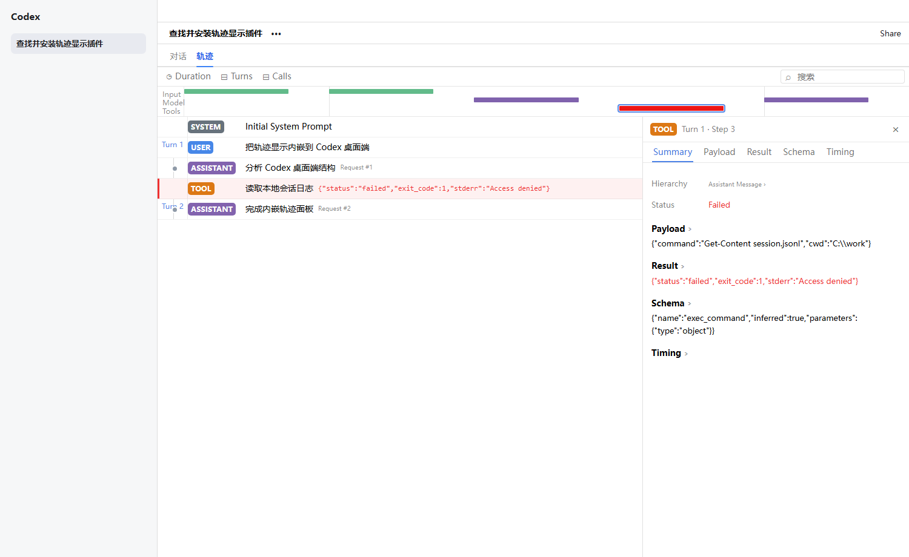
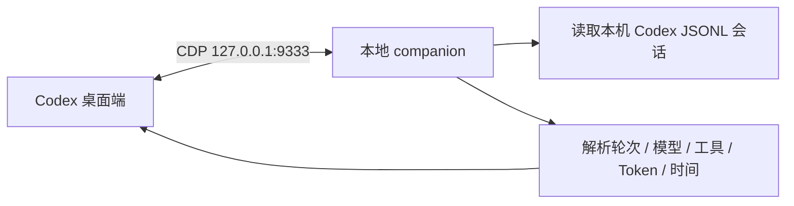

# Codex Trajectory Panel

[](https://github.com/cpsGGG/codex-trajectory-panel)
[](https://nodejs.org/)
[](LICENSE)

在 Windows 版 Codex 桌面端中查看当前任务的本地执行轨迹：轮次、模型调用、工具调用、输入上下文、Token、缓存命中和耗时。

> [!IMPORTANT]
> 这是非官方社区项目，与 OpenAI 无隶属或背书关系。它通过仅监听 `127.0.0.1` 的 Chrome DevTools Protocol（CDP）连接 Codex 渲染器。Codex 更新可能改变页面结构，从而需要适配新版本。



## 功能

- 在任务标题区域增加独立的“对话 / 轨迹”切换。
- 按事件顺序显示 `SYSTEM`、`USER`、`REASONING`、`MODEL`、`ASSISTANT` 和 `TOOL`。
- 支持 `Duration`、`Turns` 和 `Calls` 三种轨迹组织方式。
- 查看模型请求、回复预览、推理 Token、输出 Token、TTFT、Generation 和 Throughput。
- 查看工具调用的 Summary、Payload、Result、Schema 和 Timing。
- 在对话页显示轮数、步骤数、Token、缓存命中率和输出速度统计。
- 自动跟随当前 Codex 任务，并在本机会话日志更新后刷新。
- 不修改 Microsoft Store 安装目录或 `app.asar`。

## 工作原理



后台 companion 读取 `~/.codex/sessions` 下与当前任务对应的 JSONL 文件，生成结构化轨迹，再把只读界面注入 Codex 当前任务区域。它不会启动 Web 服务，也不会把会话内容上传到远程服务器。

Codex 本地日志不包含完整的服务端流式计时，因此 TTFT 和 Generation 会标记为根据本地事件时间戳推算。

## 环境要求

- Windows 10 或 Windows 11
- Microsoft Store 版 OpenAI Codex
- Node.js 22 或更新版本，并已加入 `PATH`
- Windows PowerShell 5.1 或 PowerShell 7

## 安装

在 PowerShell 中运行：

```powershell
git clone https://github.com/cpsGGG/codex-trajectory-panel.git
cd codex-trajectory-panel
powershell -ExecutionPolicy Bypass -File .\scripts\install.ps1
```

安装器会创建：

- 桌面快捷方式 `Codex - Trajectory`
- 登录启动项 `Codex Trajectory Panel`
- 每分钟运行的隐藏健康检查任务

以后从桌面的 `Codex - Trajectory` 启动 Codex。显式启动入口需要给 Codex 添加本机调试参数；如果已经运行的是未启用 CDP 的 Codex，入口可能会重启该实例，请先保存正在编辑的内容。

## 手动运行

只连接已经以 CDP 模式运行的 Codex，不启动或重启应用：

```powershell
node .\scripts\launcher.mjs --passive --port=9333
```

使用独立 companion 启动 Codex：

```powershell
node .\scripts\launcher.mjs --launch --port=9333
```

关闭 companion：

```powershell
node .\scripts\launcher.mjs --shutdown
```

## 卸载

```powershell
powershell -ExecutionPolicy Bypass -File .\scripts\uninstall.ps1
```

卸载脚本会停止 companion，并删除启动快捷方式和健康检查任务。源码目录以及 Codex 自己的会话数据不会被删除。

## 隐私与安全

- 会话解析和界面渲染全部在本机完成。
- companion 只监听 `127.0.0.1`，默认 CDP 端口为 `9333`，控制端口为 `19333`。
- 面板会显示提示词、工具参数和工具结果，其中可能包含敏感内容；请谨慎截图或录屏。
- CDP 没有独立登录认证。启用期间，同一台电脑上的其他本地进程可能访问该调试端口。
- 仓库不会跟踪浏览器测试配置、Codex 会话、日志或真实运行截图。

## 测试

```powershell
npm test
```

测试使用合成会话数据，不需要真实 Codex 会话。可在浏览器中打开 `tests/panel-harness.html` 检查静态界面。

## 目录结构

```text
codex-trajectory-panel/
├── .codex-plugin/          # Codex 插件清单
├── assets/                 # 注入到 Codex 的面板界面
├── scripts/
│   ├── launcher.mjs        # companion、CDP 连接与生命周期
│   ├── session-parser.mjs  # 本机会话解析
│   ├── install.ps1         # Windows 安装
│   └── uninstall.ps1       # Windows 卸载
├── skills/                 # Codex 使用与排障 Skill
├── tests/                  # 合成数据、解析器和界面测试
├── LICENSE
└── THIRD_PARTY_NOTICES.md
```

## 常见问题

### 没有出现“轨迹”标签

1. 确认从 `Codex - Trajectory` 快捷方式启动。
2. 确认 Node.js 版本：`node --version`。
3. 查看日志：`~/.codex/trajectory-panel/companion.log`。
4. 运行 `node .\scripts\launcher.mjs --passive --port=9333` 检查连接。

### 更新 Codex 后失效

先退出 Codex，再从 `Codex - Trajectory` 重新启动。如果日志显示已经注入但界面缺失，通常说明 Codex 的页面结构发生了变化，请提交 Issue，并附上 Codex 版本和去除隐私内容后的日志片段。

### 轨迹数据为空

先在左侧打开一个本地 Codex 任务。面板通过任务 ID 和标题匹配 `~/.codex/sessions` 中的会话文件；云端对话或尚未写入本地日志的任务可能无法显示。

## 开发

项目没有运行时 npm 依赖。修改后至少执行：

```powershell
node --check .\assets\trajectory-panel.js
node --check .\scripts\launcher.mjs
node --check .\scripts\session-parser.mjs
npm test
```

提交代码时不要加入 `tests/cdp-profile`、`tests/chrome-profile`、本机日志或包含真实任务内容的截图。

## 致谢

- Windows Codex 定位和 loopback CDP 注入思路参考了 MIT 许可的 [Tangc/codex-skin-launcher](https://github.com/Tangc/codex-skin-launcher)。
- 详情检查器的信息架构和交互参考并适配自 MIT 许可的 [deepseek-ai/deepseek-harness](https://github.com/deepseek-ai/deepseek-harness) Trajectory UI。
- 完整第三方声明见 [THIRD_PARTY_NOTICES.md](THIRD_PARTY_NOTICES.md)。

## License

[MIT](LICENSE)
