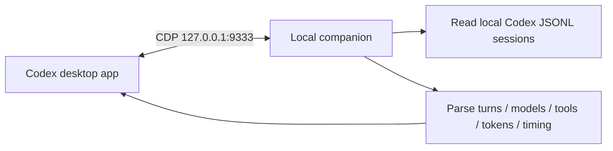

# Codex Trajectory Panel

[简体中文](README.md) | **English**

[](https://github.com/cpsGGG/codex-trajectory-panel)
[](https://nodejs.org/)
[](LICENSE)

View the local execution trajectory of the current task inside the Codex desktop app for Windows, including turns, model calls, tool calls, input context, tokens, cache hits, and timing.

> [!IMPORTANT]
> This is an unofficial community project and is not affiliated with or endorsed by OpenAI. It connects to the Codex renderer through the Chrome DevTools Protocol (CDP), listening only on `127.0.0.1`. Codex updates may change the page structure and require compatibility updates.


## Features

- Adds a separate Conversation / Trajectory switch in the task title area.
- Displays `SYSTEM`, `USER`, `REASONING`, `MODEL`, `ASSISTANT`, and `TOOL` events in chronological order.
- Organizes traces by `Duration`, `Turns`, or `Calls`.
- Shows model requests, response previews, reasoning tokens, output tokens, TTFT, generation time, and throughput.
- Shows tool call Summary, Payload, Result, Schema, and Timing.
- Adds turn, step, token, cache hit rate, and output speed statistics to the conversation view.
- Follows the active Codex task and refreshes when its local session log changes.
- Does not modify the Microsoft Store installation directory or `app.asar`.

## How it works



The background companion reads the JSONL file for the current task from `~/.codex/sessions`, builds a structured trace, and injects a read-only interface into the current Codex task area. It does not start a web server or upload session content to a remote service.

Codex local logs do not contain complete server-side streaming timing. TTFT and generation time are therefore marked as estimates derived from local event timestamps.

## Requirements

- Windows 10 or Windows 11
- Microsoft Store version of OpenAI Codex
- Node.js 22 or later available on `PATH`
- Windows PowerShell 5.1 or PowerShell 7

## Installation

Run in PowerShell:

```powershell
git clone https://github.com/cpsGGG/codex-trajectory-panel.git
cd codex-trajectory-panel
powershell -ExecutionPolicy Bypass -File .\scripts\install.ps1
```

The installer creates:

- A desktop shortcut named `Codex - Trajectory`
- A sign-in startup entry named `Codex Trajectory Panel`
- A hidden health check task that runs once per minute

Start Codex from the `Codex - Trajectory` desktop shortcut. This launch entry adds local debugging arguments to Codex. If Codex is already running without CDP enabled, the launcher may restart that instance, so save any work in progress first.

## Manual operation

Connect only to a Codex instance that is already running with CDP enabled, without launching or restarting the app:

```powershell
node .\scripts\launcher.mjs --passive --port=9333
```

Launch Codex through the companion:

```powershell
node .\scripts\launcher.mjs --launch --port=9333
```

Stop the companion:

```powershell
node .\scripts\launcher.mjs --shutdown
```

## Uninstallation

```powershell
powershell -ExecutionPolicy Bypass -File .\scripts\uninstall.ps1
```

The uninstaller stops the companion and removes the startup shortcut and health check task. It does not remove the source directory or any Codex session data.

## Privacy and security

- Session parsing and interface rendering happen entirely on your computer.
- The companion listens only on `127.0.0.1`. The default CDP port is `9333`, and the control port is `19333`.
- The panel can display prompts, tool arguments, and tool results that may contain sensitive information. Review screenshots and recordings before sharing them.
- CDP has no separate login authentication. While it is enabled, other local processes on the same computer may be able to access the debugging port.
- Browser test profiles, Codex sessions, logs, and real runtime screenshots are excluded from the repository.

## Testing

```powershell
npm test
```

Tests use synthetic session data and do not require a real Codex session. Open `tests/panel-harness.html` in a browser to inspect the static interface.

## Project structure

```text
codex-trajectory-panel/
├── .codex-plugin/          # Codex plugin manifest
├── assets/                 # Panel interface injected into Codex
├── scripts/
│   ├── launcher.mjs        # Companion, CDP connection, and lifecycle
│   ├── session-parser.mjs  # Local session parser
│   ├── install.ps1         # Windows installer
│   └── uninstall.ps1       # Windows uninstaller
├── skills/                 # Codex usage and troubleshooting skill
├── tests/                  # Synthetic data, parser, and interface tests
├── LICENSE
└── THIRD_PARTY_NOTICES.md
```

## Troubleshooting

### The Trajectory tab does not appear

1. Confirm that Codex was started from the `Codex - Trajectory` shortcut.
2. Check the Node.js version with `node --version`.
3. Inspect `~/.codex/trajectory-panel/companion.log`.
4. Run `node .\scripts\launcher.mjs --passive --port=9333` to test the connection.

### The panel stopped working after a Codex update

Exit Codex and restart it from `Codex - Trajectory`. If the log says the panel was injected but the interface is missing, the Codex page structure has probably changed. Open an issue with the Codex version and a log excerpt after removing private information.

### The trajectory is empty

Open a local Codex task in the sidebar. The panel matches the task ID and title against session files in `~/.codex/sessions`. Cloud conversations and tasks that have not yet been written to a local log may not appear.

## Development

The project has no runtime npm dependencies. Run at least the following checks after making changes:

```powershell
node --check .\assets\trajectory-panel.js
node --check .\scripts\launcher.mjs
node --check .\scripts\session-parser.mjs
npm test
```

Do not commit `tests/cdp-profile`, `tests/chrome-profile`, local logs, or screenshots containing real task content.

## Acknowledgements

- Windows Codex discovery and loopback CDP injection were inspired by the MIT-licensed [Tangc/codex-skin-launcher](https://github.com/Tangc/codex-skin-launcher).
- The detail inspector information architecture and interaction model were adapted from the MIT-licensed Trajectory UI in [deepseek-ai/deepseek-harness](https://github.com/deepseek-ai/deepseek-harness).
- See [THIRD_PARTY_NOTICES.md](THIRD_PARTY_NOTICES.md) for the complete third-party notice.

## License

[MIT](LICENSE)
